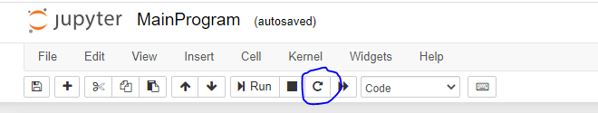

# Tucil-3-STIMA
Tugas Kecil 3 IF2211 Strategi Algoritma - Implementasi Algoritma A* untuk Menentukan Lintasan Terpendek

## Penjelasan Singkat Program
Untuk dapat mencari lintasan terpendek dari sebuah input file graf pada peta kami menggunakan algoritma A* (Astar). Algoritma A* yang kami buat hampir mirip seperti algoritma BFS (Breadth First Search) karena pencarian lintasan terpendek dilakukan dengan membangkitkan simpul yang bertetangga dengan simpul yang sedang diperiksa tetapi pada algoritma A* urutan pembangkitan simpulnya diurutkan berdasarkan nilai F(n). F(n) merupakan heuristic evaluation fuction. Karena ide dari algoritma A* ini adalah menghindari untuk membangkitkan lintasan yang costnya mahal, maka nilai F(n) = g(n) + h(n), g(n) merupakan cost seberapa jauh untuk mencapai simpul n dari simpul awal serta h(n) merupakan estimasi biaya dari simpul n ke simpul goal. Pada pengerjaan tugas kecil 3 ini, nilai g(n) merupakan total jarak yang telah ditempuh dari simpul awal ke simpul n dan nilai h(n) merupakan jarak garis lurus dari simpul n ke simpul goal.

Untuk dapat mengimplementasikan algoritma A* ini kami membutuhkan sebuah kelas priority queue untuk dapat mengurutkan simpul yang akan dibangkitkan sesuai dengan nilai f(n) jika nilai f(n) kecil maka akan dibangkitkan terlebih dahulu. Lalu kami juga membutuhkan sebuah kelas graf untuk merepresentasikan graf dari input file graf. Algoritma A* dilakukan pada kelas graf. Lalu kami juga membutuhkan sebuah fungsi untuk mengolah file input (file processing). Selanjutnya untuk dapat menampilkan visualisasi peta, main program kami buat pada jupyter notebook.

## REQUIREMENT
- Minimal menggunakan python 3.7.3
- Telah terinstall jupyter notebook dan modul folium. Jika belum lakukan command berikut:  
`		pip install jupyter notebook`  
`		pip install folium`
- Jika ternyata masih ada modul yang belum diinstall silahkan install edengan menggunakan command:  
`		pip install <nama modul>`

## CARA MENGGUNAKAN PROGRAM
1. Untuk dapat menjalankan program pertama lakukan clone pada repository git ini  
`	git clone "https://github.com/pranagusriana/Tucil-3-STIMA.git"`
2. Setelah itu buka folder src pada command promt  

3. Setelah requirement terpenuhi ketikkan jupyter notebook untuk membuka jupyter notebook  

4. Setelah jupyter notebook terbuka, maka klik pada file MainProgram.ipynb  

5. Setelah file MainProgram.ipynb terbuka lakukan restart kernel  

6. Pertama kali lakukan running pada cell 0 untuk dapat mengimport modul dan membuat objek graf yang akan digunakan selama program berjalan  

7. Untuk dapat menampilkan visualisasi peta dan mencari lintasan terpendek pada peta pertama-tama inputkan dulu nama nama file yang berada pada folder test yang akan diinputkan (cukup masukkan nama filenya saja misal peta-itb.txt). Input file dilakukan dengan melakukan running pada cell 1. Program akan meminta input pada user dan user harus mengisinya jika ingin menampilkan visualisasi dan mencari lintasan terpendek.  

8. Untuk dapat melihat visualisasi awal peta bisa dilakukan dengan melakukan running pada cell 2.  

9. Untuk dapat mencari lintasan terpendek antar dua simpul (simpul awal ke simpul goal) silahkan lakukan running pada cell 3. Program akan meminta input nama simpul awal dan simpul goal pada user lalu akan menampilkan lintasan terpendek dalam bentuk text beserta jaraknya.  **CATATAN:** Nama simpul dapat diketahui dengan mengklik marker berwarna merah pada visualisasi peta di cell 2.  

10. Untuk dapat memvisualisasikan jalur terpendek pada peta, silahkan lakukan running pada cell 4.  

